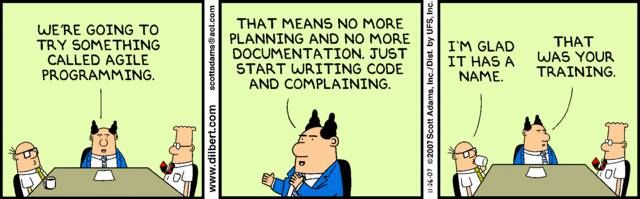

name: inverse
layout: true
class: center, middle, inverse
---

.title-slide[
# Applying your coding practices to your documentation
By Kris Geusenbroek and Paulien van Alst
]
.remark-slide-content.img-right-full.inverse[
]

---
layout: false

.left-column[ # Who are we ?]
.remark-slide-content.presentation[] 
.right-column[
### Paulien van Alst - @PaulienVanAlst
.job-description[Podcaster at BarCoding]
.job-description[Software engineer @OpenValue]
]
--
.right-column[### Kris Geusebroek]
.right-column[Data Engineer @GoDataDriven]

---
.left-column[# Current project
### Introduction
]
--
.right-column[
- FIOD (Fiscal Investigation Services)
]
--
.right-column[
- Started two years ago ]
--
.right-column[
- Back-end: Microservices (each in one repository)
]
--
.right-column[
- Front-end: React application
]
--
.right-column[
- User interface design by UX designer
]
--
.remark-slide-content[]
---

name: inverse
layout: true
class: center, middle, inverse
---

.left-column.inverse[# Current project
### Introduction
### Challenge
]
--
.vertical-middle[
## How to get back on track with documentation?

# and

## Make sure we will keep it up to date
]
---
layout: false

.left-column[# Solve the challenge
### Who?
]
--

.right-column[
Who is reading and writing documentation?
] 
--
.right-column[
- architect
]  

--
.right-column[
- developers
]
--
.right-column[
- (business) analysts
]

--
.right-column[
- UX designers
]

---
.left-column[# Solve the challenge
   ### Who?
   ### What?
   ]
--
.right-column[
What do they prefer?
]   
.right-column[
- architect: .red.bold[ keep track of their drawings ]
]
--
.right-column[
- developers: .red.bold[ stay in the codebase ]
]
--
.right-column[
- (business) analysts: .red.bold[ easy accessible and editable documentation ]
]
--

.right-column[
- UX designers: .red.bold[ writing documentation for the tech team AND for the users ]
]

---
.left-column[# Standard solutions
]

.right-column[
- Confluence: + user friendly editor - bad search - far far away from the code base
]  

--
.right-column[
 - Word documents for user documentation
 ]
 
--
.right-column[
 - Architectural drawings ?
 ]
 
--
.right-column[
 .red.bold[-> All different systems solving the documentation challenge]
]

---
class: center, middle

# Slide for passing to the solution

---

.left-column[# Solution
   ### Mkdocs
   ]

---

.left-column[# Solution
   ### Mkdocs
   ### Git
]

---

.left-column[# Solution
   ### Mkdocs
   ### Git
   ### Git submodules
   ]

---

.left-column[# Solution
   ### Mkdocs
   ### Git
   ### Git submodules
   ### Gitlab editor
   
   ]
---

.left-column[# Solution
   ### Mkdocs
   ### Git
   ### Git submodules
   ### Gitlab editor
   ### Docker container
   ]